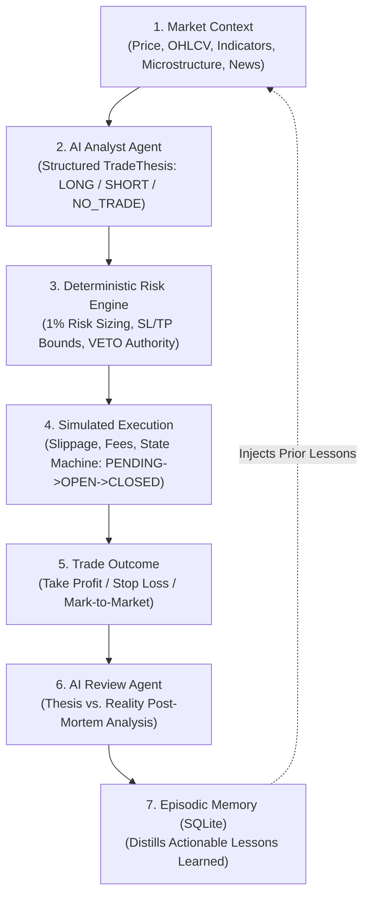
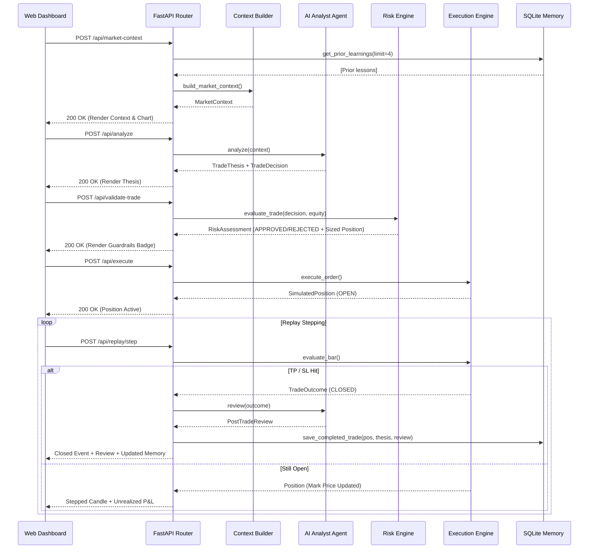

# NAVEX Trading AI — Architecture Specification

## 1. System Overview

**NAVEX Trading AI** is an autonomous, simulated quantitative trading prototype built for the **NAVEX Capital Technical Evaluation**. It implements a complete, closed-loop trading lifecycle:

---

## 2. Core Subsystems & Responsibilities

### 2.1 Market Context Layer (`backend/services/`)
- **`market_data/feed.py`**: Fetches public OHLCV candles via Binance public REST endpoints with zero private API keys. Automatically falls back to deterministic historical candle series if offline.
- **`market_data/microstructure.py`**: Adapted from Crypto-Pilot's iceberg detector. Computes order-book depth features: bid/ask volume imbalance, price spread, order level imbalance, size standard deviations, and large whale order detection.
- **`technical_analysis/indicators.py`**: Pure Python / NumPy indicator calculations. Computes EMA 20, EMA 50, EMA 200, Wilder's smoothed RSI (14), Average True Range (ATR 14), Volatility (20-period standard deviation of returns), swing extrema, dynamic Support & Resistance clusters, and Market Structure classification (`BULLISH_TREND`, `BEARISH_TREND`, `BREAKOUT_POTENTIAL`, `BREAKDOWN_POTENTIAL`, `RANGE_BOUND`).
- **`news/news_service.py`**: Ingests and sanitizes macro/catalyst headlines using regex cleaners adapted from Crypto-Pilot. Generates structured `NewsItem` objects.
- **`context/context_builder.py`**: Aggregates price, indicators, microstructure, news, and prior trade memory into a unified, strongly-typed `MarketContext` Pydantic model.

### 2.2 AI Analyst Agent (`backend/agents/analyst_agent.py`)
- Receives the rich `MarketContext` and prior episodic lessons.
- Supports multi-provider LLM integration (OpenAI, Gemini, Anthropic) via structured outputs (`TradeThesis`).
- Features a built-in deterministic quantitative reasoning engine as a zero-dependency fallback, guaranteeing 100% demo uptime without external API keys.
- Outputs a strongly-typed `TradeThesis`:
  - `bias`: `LONG`, `SHORT`, or `NO_TRADE`
  - `confidence`: float (0.0 to 1.0)
  - `thesis`: detailed qualitative and technical narrative
  - `catalysts`, `supporting_factors`, `conflicting_factors`
  - `key_levels`: entry, stop loss, take profit, primary support/resistance
  - `invalidation_condition`: explicit price/market condition nullifying the thesis

### 2.3 Deterministic Risk Engine (`backend/risk/risk_engine.py`)
- **Critical Principle**: The LLM does **NOT** have final authority over capital or risk.
- Enforces strict mathematical guardrails:
  1. **SL & TP Directional Orientation**:
     - For `LONG`: `Stop Loss < Entry < Take Profit`
     - For `SHORT`: `Take Profit < Entry < Stop Loss`
  2. **Stop Distance Bounds**: Stop distance must be between `0.3%` (minimum breathing room to avoid noise whipsaws) and `8.0%` (maximum capital protection limit).
  3. **Risk-to-Reward Ratio**: Must satisfy `R:R >= 1.5:1` (default target: `2.0:1` or higher).
  4. **Deterministic Position Sizing Formula**:
     $$\text{Risk Amount} = \text{Account Equity} \times \text{Risk Percentage (1\%)}$$
     $$\text{Position Size} = \frac{\text{Risk Amount}}{|\text{Entry} - \text{Stop Loss}|}$$
  5. **Leverage & Exposure Cap**: Limits total notional exposure to `2.0x` account equity.
- **Veto Authority**: If any check fails, the trade is immediately vetoed (`REJECTED` -> `NO_TRADE`) with transparent rejection reasons displayed in the UI.

### 2.4 Simulated Execution Engine & Portfolio (`backend/simulation/`)
- **`execution_engine.py`**:
  - Implements an event-driven paper trading state machine: `PENDING` $\rightarrow$ `FILLED` $\rightarrow$ `OPEN` $\rightarrow$ `CLOSED`.
  - Realistic execution costs: `0.02%` adverse slippage on entry and `0.05%` taker exchange fees on open and close.
  - Bar-by-bar evaluation checking if candle highs/lows breach Take Profit or Stop Loss targets.
  - Zero live exchange order placement.
- **`portfolio.py`**:
  - Virtual account starting at `$100,000.00`.
  - Maintains real-time mark-to-market unrealized P&L, realized P&L, margin locking, win rate, and an equity curve history ledger.
- **`replay_engine.py`**:
  - Provides 3 deterministic historical scenarios:
    1. `BTC_BULL_BREAKOUT`: Resistance breakout with volume, advancing to Take Profit (+2.50% net return).
    2. `BTC_BEAR_BREAKDOWN`: Support loss short execution, capturing downside to Take Profit.
    3. `BTC_FAILED_BREAKOUT`: Bull trap fakeout, demonstrating risk engine protection at Stop Loss (capped at 1% equity).

### 2.5 AI Review Agent & Episodic Memory (`backend/agents/`, `backend/memory/`)
- **`review_agent.py`**:
  - Automatically triggered upon trade closure.
  - Evaluates the original `TradeThesis` against the actual `TradeOutcome`.
  - Outputs a structured `PostTradeReview`: outcome label, thesis accuracy (`True`/`False`), execution quality (`EXCELLENT`, `ACCEPTABLE`, `SUBOPTIMAL`, `POOR`), what worked, what failed, root cause analysis ("Why?"), and 1-2 actionable lessons.
- **`memory/database.py`**:
  - Persistent SQLite storage (`navex_memory.db`) storing completed trades, theses, reviews, and distilled lessons.
  - Before any new trade analysis, queries the most recent lessons and injects them into the `MarketContext.prior_learnings` array.
  - **Feedback Loop**: Future analyses explicitly account for past mistakes (e.g., cautionary notes against chasing high-RSI breakouts).

---

## 3. Data & Communication Flows

### 3.1 End-to-End Decision & Execution Flow

---

## 4. Architectural Decision Records (ADRs)

### ADR-01: Deterministic Risk Engine Veto Over LLMs
- **Status**: Implemented.
- **Context**: LLMs are probabilistic models susceptible to hallucinations, inconsistent position sizing, or proposing invalid stop losses on the wrong side of market entry.
- **Decision**: All capital allocation, position sizing, and risk guardrails are enforced by a pure mathematical module (`RiskEngine`). The risk engine holds absolute veto power: if any constraint is violated, the trade is rejected to `NO_TRADE`.
- **Consequence**: Guaranteed capital preservation and zero chance of unmanaged position sizes.

### ADR-02: Self-Contained Repository Isolation
- **Status**: Implemented.
- **Context**: The existing `Crypto-Pilot-AI-Models` project had multiple broken dependencies, missing model weights, and hardcoded AWS credentials.
- **Decision**: Build `navex-trading-ai/` as an isolated, self-contained subfolder at the root, treating the original repository strictly as a reference document.
- **Consequence**: Zero disruption to the original repository; pristine clean architecture for NAVEX evaluation.

### ADR-03: Dual-Mode AI Integration (Real LLM + Deterministic Engine)
- **Status**: Implemented.
- **Context**: Relying solely on external LLM APIs during an interview demo introduces external failure points (network latency, quota exhaustion, missing API keys).
- **Decision**: Implement a unified interface that calls real LLMs (OpenAI, Gemini, Anthropic) if configured, with a rich, deterministic quantitative rule engine as an instant fallback.
- **Consequence**: The demo works 100% reliably out of the box with zero setup.

### ADR-04: Episodic Memory Feedback Loop via SQLite
- **Status**: Implemented.
- **Context**: Real quantitative traders improve by conducting post-mortems and applying learned rules to future setups.
- **Decision**: Store trade outcomes and reviews in SQLite. Extract 1-2 actionable lesson strings from each trade review and inject them into subsequent `MarketContext` prompts.
- **Consequence**: Realizes an authentic "Feedback-Informed Analysis" loop without falsely claiming complex on-the-fly model re-training.
