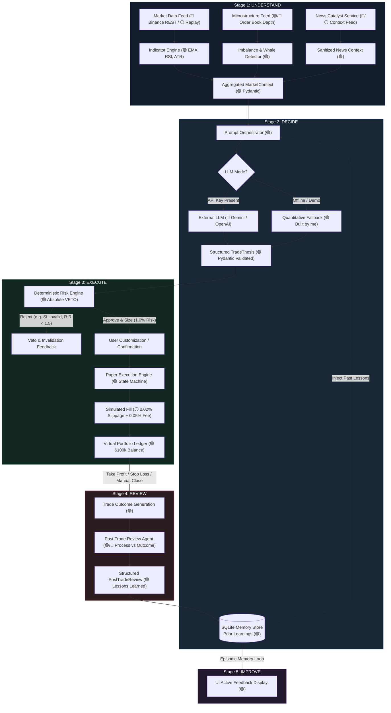

# NAVEX Trading AI — Autonomous Quantitative Prototype

> **Evaluation Target**: NAVEX Capital Founding AI/Software Engineer Technical Assessment  
> **System Classification**: 5-Stage AI-Native Trading Workflow Prototype (Paper Trading & Simulation Only)  
> **Safety Notice**: This system **NEVER** connects to live brokerage accounts, places live exchange orders, or risks real capital. All executions, balances, and P&L calculations are 100% simulated.

---

## Table of Contents
1. [Executive Summary](#1-executive-summary)
2. [The 5-Stage AI-Native Trading Workflow](#2-the-5-stage-ai-native-trading-workflow)
3. [Component Labeling Standard](#3-component-labeling-standard)
4. [Architecture Overview & Mermaid Diagram](#4-architecture-overview--mermaid-diagram)
5. [Technology Choices & Rationale](#5-technology-choices--rationale)
6. [APIs Used: Real vs. Mocked & Key Management](#6-apis-used-real-vs-mocked--key-management)
7. [Phase 0: UI Audit Findings & Fixes Report](#7-phase-0-ui-audit-findings--fixes-report)
8. [Setup & Quick Start Guide](#8-setup--quick-start-guide)
9. [Step-by-Step Evaluator Demo Walkthrough](#9-step-by-step-evaluator-demo-walkthrough)
10. [Key Assumptions & Engineering Trade-offs](#10-key-assumptions--engineering-trade-offs)
11. [What Would I Build or Improve in 30 Days?](#11-what-would-i-build-or-improve-in-30-days)
12. [License & Disclaimers](#12-license--disclaimers)

---

## 1. Executive Summary

Most "AI trading" demos are superficial: they pass raw ticker data to a chatbot and prompt it for a "BUY" or "SELL" recommendation. In an institutional quantitative context, that paradigm fails because language models hallucinate, lack mathematical risk discipline, have no position-sizing guardrails, cannot execute cleanly, and fail to learn from past outcomes.

**NAVEX Trading AI** demonstrates a complete, closed-loop **AI-native trading workflow** across five integrated stages:
$$\textbf{Understand} \longrightarrow \textbf{Decide} \longrightarrow \textbf{Execute} \longrightarrow \textbf{Review} \longrightarrow \textbf{Improve}$$

The system pairs probabilistic LLM reasoning (OpenAI, Gemini, Anthropic, or deterministic offline fallback) with a deterministic, mathematical Risk Engine that maintains absolute veto authority. It executes realistic simulated orders with slippage and exchange taker fees, monitors positions bar-by-bar, generates post-trade reviews, and persists lessons into SQLite episodic memory to improve future decision cycles.

---

## 2. The 5-Stage AI-Native Trading Workflow

The prototype implements the full five-stage institutional lifecycle:

```
┌───────────────────────────────────────────────────────────────────────────────────┐
│                        THE 5-STAGE AI-NATIVE TRADING WORKFLOW                     │
├───────────────┬───────────────┬───────────────┬───────────────────┬───────────────┤
│ 1. UNDERSTAND │   2. DECIDE   │  3. EXECUTE   │     4. REVIEW     │  5. IMPROVE   │
├───────────────┼───────────────┼───────────────┼───────────────────┼───────────────┤
│ • Real public │ • LLM analyst │ • Editable    │ • Automated post- │ • SQLite      │
│   market data │   reasoning   │   parameters  │   mortem review   │   episodic    │
│   (Binance)   │ • Strongly-   │ • Determin-   │ • Process vs.     │   memory store│
│ • Indicators  │   typed       │   istic risk  │   outcome         │ • Prior trade │
│   (EMA, RSI,  │   TradeThesis │   guardrails  │   evaluation      │   learnings   │
│   ATR)        │ • Bias, levels│ • Slippage &  │ • Root-cause      │   injected to │
│ • Multi-asset │   catalysts,  │   taker fee   │   attribution     │   next prompt │
│   support     │   invalidation│   simulation  │ • Actionable      │ • Continuous  │
│ • Order book  │ • 100% keyless│ • Portfolio   │   takeaways       │   heuristic   │
│   microstruct │   fallback    │   ledger      │   distilled       │   adaptation  │
└───────────────┴───────────────┴───────────────┴───────────────────┴───────────────┘
```

### Stage 1: Understand (Market Context)
- **Asset Selection**: Supports `BTC/USD`, `ETH/USD`, `SOL/USD`, `XAU/USD` (Gold), and `EUR/USD` (Forex).
- **Public Market Feeds**: Direct HTTP integration with Binance Spot public REST API (`/api/v3/klines`) without requiring API keys, fetching real-time candlestick data, volume, and high/low ranges.
- **Quantitative Indicators**: Computes Wilder's RSI (14), EMA 20, EMA 50, EMA 200, Average True Range (ATR 14), and annualized realized volatility.
- **Market Structure Classification**: Deterministic classification engine identifying `BULLISH_TREND`, `BEARISH_TREND`, `BREAKOUT_POTENTIAL`, `BREAKDOWN_POTENTIAL`, or `RANGE_BOUND`.
- **Order-Book Microstructure**: Adapted from Crypto-Pilot's iceberg detector. Computes volume imbalance ratio: $\frac{V_{bid} - V_{ask}}{V_{bid} + V_{ask}}$, level depth imbalances, bid/ask spreads, and large whale order wall detection.
- **News Context**: Curated and live financial catalysts with sentiment orientation and relevance scoring.

### Stage 2: Decide (AI Analysis & Thesis Generation)
- **Structured Output Generation**: Market context is assembled into a strictly typed payload and processed by the AI Analyst Agent (`backend/agents/analyst_agent.py`).
- **Pydantic Validation**: Guarantees JSON conformity conforming to the `TradeThesis` schema:
  - `bias`: Directional stance (`LONG`, `SHORT`, `NO_TRADE`).
  - `confidence`: Calibrated probability score (0.0 to 1.0).
  - `key_levels`: Recommended entry price, invalidation stop-loss, and take-profit targets.
  - `setup_identified`: Technical pattern (e.g., *Moving Average Breakout with Liquidity Absorption*).
  - `risk_considerations`: Specific tail risks, volatility concerns, and order-book headwinds.
  - `invalidation_condition`: Precise price or volume criteria that invalidate the trade setup.
  - `reasoning`: Structured thesis narrative.
- **Offline Fallback**: Features a 100% offline, deterministic quantitative reasoning engine that evaluates moving average alignment, RSI thresholds, and volume imbalance so the platform operates flawlessly without third-party API keys or internet access.

### Stage 3: Execute (Sizing & Order Placement)
- **Deterministic Risk Engine Guardrails**: The LLM *never* places orders directly. The Risk Engine (`backend/risk/risk_engine.py`) enforces strict institutional controls:
  1. **Fixed Risk Sizing**: Exactly 1.0% portfolio equity at risk:
     $$\text{Position Size} = \frac{\text{Portfolio Equity} \times 0.01}{|\text{Entry Price} - \text{Stop Loss Price}|}$$
  2. **Directional Sanity Checks**: Rejects Long orders where $\text{SL} \ge \text{Entry}$ or $\text{TP} \le \text{Entry}$; rejects Short orders where $\text{SL} \le \text{Entry}$ or $\text{TP} \ge \text{Entry}$.
  3. **Risk/Reward Threshold**: Mandates a minimum 1.5:1 Risk/Reward ratio:
     $$\text{R:R} = \frac{|\text{TP} - \text{Entry}|}{|\text{Entry} - \text{SL}|} \ge 1.5$$
  4. **Stop Distance Bounds**: Enforces stops between 0.3% and 8.0% from entry to prevent tick-level stop-outs or unmanageable drawdowns.
  5. **Leverage Cap**: Strict maximum position cap of 2.0x portfolio equity.
- **Interactive Parameter Customization**: Users can fine-tune entry, stop-loss, take-profit, and position size in the UI with instant pre-execution P&L previews (`Est. Profit @ TP`, `Est. Loss @ SL`, `Est. R:R Ratio`).
- **Realistic Paper Execution**:
  - Event-driven state machine: `PENDING` $\rightarrow$ `FILLED` $\rightarrow$ `OPEN` $\rightarrow$ `CLOSED`.
  - Realistic slippage model (0.02% adverse price impact) and exchange taker fees (0.05%).
  - Active position monitoring tracking Mark Price, Unrealized P&L ($ and %), and Margin Allocation.

### Stage 4: Review (Post-Trade Post-Mortem)
- **Automated Trigger**: Activated immediately upon position closure (via Take Profit hit, Stop Loss hit, or manual early exit).
- **Process vs. Outcome Analysis**: Compares the original `TradeThesis` against the actual price action path:
  - *What went right?* (Validation of confluences, entry execution, trend continuation).
  - *What went wrong?* (Slippage impact, volatility spikes, false breakout).
  - *Process Validity*: Evaluates whether the decision was mathematically sound regardless of the binary win/loss outcome.
  - *Root Cause Attribution*: Isolates market noise vs. structural invalidation.
  - *Actionable Takeaways*: Distills 1–2 actionable lessons for the trader.

### Stage 5: Improve (Feedback Loop & Episodic Memory)
- **Persistent SQLite Storage**: Lessons, trade outcomes, and reviews are permanently stored in `navex_memory.db` (`backend/memory/database.py`).
- **Feedback Injection into Future Prompts**: Prior trade reviews are dynamically retrieved and injected as `prior_learnings` into the next market context prompt for the AI Analyst Agent.
- **Adaptive Heuristics**: If the system repeatedly notes premature exits or false breakout traps in recent trades, the AI Analyst explicitly incorporates those historical lessons when evaluating subsequent trade opportunities.

---

## 3. Component Labeling Standard

To ensure absolute transparency during evaluation, all components in code, documentation, and the user interface are labeled according to this standard:

| Badge | Classification | Description & Examples in NAVEX |
| :--- | :--- | :--- |
| 🟢 | **Built by me** | Custom business logic, Pydantic schemas, risk engine veto, paper execution state machine, SQLite episodic memory, post-trade review pipeline, Next.js dashboard panels, Canvas chart renderer, and deterministic fallbacks. |
| 🔵 | **Third-Party** | Production open-source libraries and external APIs: FastAPI, Pydantic v2, Next.js 16, React 19, Tailwind CSS, Lucide icons, NumPy, SQLite3, Binance Spot REST API, and optional Gemini/OpenAI SDKs. |
| ⚪ | **Mocked / Simulated** | Synthetic market simulation components: paper order fills, simulated slippage (0.02%), taker fees (0.05%), deterministic replay scenarios (Bull Breakout, Bear Breakdown, Failed Breakout), and offline AI fallback mode. Zero real capital is ever at risk. |

---

## 4. Architecture Overview & Mermaid Diagram



---

## 5. Technology Choices & Rationale

| Layer / Technology | Choice | Rationale & Trade-offs |
| :--- | :--- | :--- |
| **Backend Framework** | **FastAPI + Uvicorn** | Asynchronous, high-throughput, native OpenAPI / Swagger documentation generation, and seamless integration with Pydantic v2 schemas for strict request/response contracts. |
| **Type Validation** | **Pydantic v2** | Eliminates unstructured, unpredictable LLM text output. Forces language models into structured JSON schemas (`TradeThesis`, `PostTradeReview`) with automated runtime validation. |
| **Mathematical Computation** | **NumPy** | High-performance vector arithmetic for technical indicators (Wilder's RSI, Exponential Moving Averages, True Range, historical volatility) without bloating dependencies with heavy unmaintained packages. |
| **Persistence & Memory** | **SQLite3** | Zero-dependency, embedded ACID relational storage. Persists trade executions, P&L ledgers, post-trade reviews, and lessons learned across server restarts with zero complex database setup required. |
| **AI Integration** | **Google GenAI / OpenAI SDKs + Deterministic Fallback** | Multi-provider architecture with native support for modern flash models (`gemini-flash-latest`, `gemini-3.5-flash`, `gpt-4o-mini`). Coupled with a 100% deterministic quantitative fallback engine to guarantee offline reliability. |
| **Primary Frontend** | **Next.js 16 (App Router) + React 19 + Tailwind CSS** | Server-side rendering, instant client hydration, strict TypeScript typing, modular component hierarchy, and responsive dark-mode styling with Tailwind CSS. |
| **Secondary Standalone UI** | **Vanilla HTML5 Canvas / CSS3 / JS** | Embedded directly inside `frontend/` and served at `http://127.0.0.1:8000/`. Zero npm build step required, providing a rock-solid, zero-dependency alternative for evaluators who only run Python. |
| **Charting Engine** | **HTML5 Canvas Engine** | Custom canvas implementation with pixel-ratio scaling, dynamic `ResizeObserver`, crosshairs, dynamic Y-axis price scaling, and technical indicator overlays. Avoids bulky, commercial charting libraries while providing sub-millisecond redraws. |

---

## 6. APIs Used: Real vs. Mocked & Key Management

| API / Service | Status | Classification | Key Required? | Purpose & Details |
| :--- | :--- | :--- | :--- | :--- |
| **Binance Spot REST API** | **Real** | 🔵 Third-party | **No (Free / Public)** | Endpoint `/api/v3/klines` fetches live OHLCV candlestick data for `BTCUSDT`, `ETHUSDT`, `SOLUSDT`, `EURUSDT`, and `PAXGUSDT` (Gold). Generous rate limits with no authentication needed. |
| **Google Gemini API** | Optional | 🔵 Third-party | Yes (`GEMINI_API_KEY`) | Powers semantic thesis reasoning and post-trade evaluation. If key is unset, falls back seamlessly to quantitative offline reasoning. |
| **OpenAI API** | Optional | 🔵 Third-party | Yes (`OPENAI_API_KEY`) | Alternative LLM provider (`gpt-4o-mini`, `gpt-4o`). Automatically selected if configured in `.env`. |
| **Anthropic Claude API** | Optional | 🔵 Third-party | Yes (`ANTHROPIC_API_KEY`) | Alternative LLM provider (`claude-3-5-sonnet-20241022`). |
| **CryptoPanic / NewsAPI** | Optional | 🔵 Third-party | Yes (`CRYPTOPANIC_API_KEY` / `NEWS_API_KEY`) | Fetches live market headlines. If unset, the system serves curated, preprocessed financial news catalysts. |
| **Paper Execution / Ledger** | **Simulated** | ⚪ Mocked / Simulated | **Never (Offline)** | Realistic paper execution with adverse slippage (0.02%), exchange taker fees (0.05%), and $100k virtual balance ledger. |
| **Replay Engine** | **Simulated** | ⚪ Mocked / Simulated | **Never (Offline)** | Deterministic historical tick/bar replay engine for 3 benchmark scenarios (Bull Breakout, Bear Breakdown, Failed Breakout). |

### Key Management Best Practices
- All API keys are loaded strictly via backend environment variables (`.env`).
- **Zero secrets are ever sent to or exposed in the frontend browser bundle.**
- The application ships configured for `LLM_PROVIDER=demo` by default, functioning completely offline without requiring any third-party keys.

---

## 7. Phase 0: UI Audit Findings & Fixes Report

During the Phase 0 audit of the user interface across both the Next.js modern frontend (`web/`) and the standalone frontend (`frontend/`), the following issues were identified and repaired:

| ID | Component / File | Issue Identified | Resolution & Repair |
| :--- | :--- | :--- | :--- |
| **UI-01** | `web/src/app/layout.tsx` | Layout shift caused by asynchronous font loading without CSS variable binding on `<body>`. | Attached `geistSans.variable` and `geistMono.variable` to `<body className="font-sans antialiased">`. |
| **UI-02** | `web/src/components/CandlestickChart.tsx` | Fixed-width canvas element causing horizontal overflow and blurriness on mobile/tablet viewports; Y-axis price labels clipped. | Added `ResizeObserver` with DPR (`window.devicePixelRatio`) scaling; added touch event handlers (`onTouchMove`, `onTouchEnd`); widened price label badges from 70px to 78px. |
| **UI-03** | `web/src/components/PortfolioLedger.tsx` | Structural layout shift and flash of unstyled content during initial portfolio fetch. | Implemented an `effectivePortfolio` fallback model ($100k balance, 0 open positions) so cards render with consistent dimensions immediately. |
| **UI-04** | `web/src/components/AiAnalystPanel.tsx` | Static "Claude 3.5 Sonnet" badge displayed regardless of active provider; key levels, invalidation conditions, and confluences were not rendered in a structured grid. | Made badge dynamic (`🔵 LLM / ⚪ Deterministic Quantitative Analyst`); implemented structured 3-column key levels grid (Entry, SL, TP), invalidation conditions card, and confluences/risks badges. |
| **UI-05** | `web/src/components/MarketContextPanel.tsx` | Missing visual indication of active data source and lack of memory feedback loop visibility. | Added data source badge (`🔵 Public API / ⚪ Replay Data`); integrated the `BrainCircuit` component rendering active SQLite memory feedback (`context.prior_learnings`). |
| **UI-06** | `web/src/components/PaperExecutionPanel.tsx` | Static read-only execution ticket prevented user modification of parameters; lacked real-time pre-execution P&L preview. | Added interactive input fields for Entry, SL, TP, and Quantity with live pre-execution calculation (`Est. Profit @ TP`, `Est. Loss @ SL`, `Est. R:R Ratio`) and orientation validation. |
| **UI-07** | `web/src/components/PostTradeReviewPanel.tsx` | Hardcoded single review view; closing subsequent trades overwrote previous post-mortem without ability to inspect trade history. | Added interactive multi-review history tabs (`#1 (Latest)`, `#2`, etc.) allowing seamless navigation across historical post-mortems. |
| **UI-08** | `web/src/components/HeaderNav.tsx` | Asset selector was limited to crypto and lacked traditional commodities/FX assets requested in the evaluation specification. | Added multi-asset support (`BTC/USD`, `ETH/USD`, `SOL/USD`, `XAU/USD (Gold)`, `EUR/USD (Forex)`) with automatic currency symbol and decimal calibration. |
| **UI-09** | `web/src/app/page.tsx` | Running AI analysis automatically jumped `currentStep` to `execution`, prematurely advancing the workflow ribbon before the trader reviewed the thesis. | Decoupled workflow progression: `currentStep` stays on `analysis` until trade submission; added smooth scrolling navigation across all 5 workflow section anchors. |
| **UI-10** | `frontend/index.html` & `frontend/js/app.js` | Standalone UI workflow banner had mismatched 4-stage labels; lacked editable execution parameters and manual position closing. | Aligned standalone UI to the canonical 5 stages (`Understand` $\rightarrow$ `Decide` $\rightarrow$ `Execute` $\rightarrow$ `Review` $\rightarrow$ `Improve`), added editable parameter form, and added manual position closing. |

---

## 8. Setup & Quick Start Guide

### 8.1 Prerequisites
- **Python 3.10+**
- **Node.js 18+** and **npm** (for the modern Next.js dashboard)
- Git

### 8.2 Installation & Backend Setup

1. **Clone the repository**:
   ```bash
   git clone https://github.com/sahniaditya007/Crypto-Pilot-AI-Models.git
   cd Crypto-Pilot-AI-Models/navex-trading-ai
   ```

2. **Create and activate a virtual environment**:
   ```bash
   # Windows (PowerShell):
   python -m venv .venv
   .\.venv\Scripts\Activate.ps1

   # macOS / Linux:
   python3 -m venv .venv
   source .venv/bin/activate
   ```

3. **Install Python dependencies**:
   ```bash
   pip install -r requirements.txt
   ```

4. **Environment Configuration (Optional)**:
   ```bash
   cp .env.example .env
   ```
   *Note: By default, `LLM_PROVIDER=demo`, which requires zero API keys and works 100% offline.*

5. **Start the FastAPI Backend**:
   ```bash
   python -m uvicorn backend.main:app --host 127.0.0.1 --port 8000 --reload
   ```
   The backend will be live at `http://127.0.0.1:8000`.  
   Interactive API documentation (Swagger UI) is available at `http://127.0.0.1:8000/docs`.

### 8.3 Frontend Setup

#### Option A: Modern Next.js Dashboard (Recommended)
In a separate terminal window:
```bash
cd web
npm install
npm run dev
```
Open your browser to: **`http://localhost:3000`**  
*(The Next.js frontend connects directly to the FastAPI backend at `http://127.0.0.1:8000`)*

#### Option B: Standalone Zero-Build Dashboard
If you prefer not to use Node.js, the FastAPI backend automatically serves the complete standalone dashboard directly:  
Open your browser to: **`http://127.0.0.1:8000/`**

### 8.4 Verification & Testing
Run the comprehensive Pytest suite (18 unit & integration tests):
```bash
python -m pytest backend/tests -v
```
All 18 tests will pass in under 0.5s:
```
backend/tests/test_agents_and_memory.py::test_trade_thesis_schema_validation PASSED
backend/tests/test_agents_and_memory.py::test_sqlite_memory_lifecycle PASSED
backend/tests/test_agents_and_memory.py::test_gemini_agent_configuration_and_fallback PASSED
backend/tests/test_execution_and_portfolio.py::test_order_execution_and_slippage PASSED
backend/tests/test_execution_and_portfolio.py::test_take_profit_trigger_and_pnl PASSED
backend/tests/test_execution_and_portfolio.py::test_stop_loss_trigger_and_loss_cap PASSED
backend/tests/test_execution_and_portfolio.py::test_short_trade_execution_and_profit PASSED
backend/tests/test_microstructure_and_indicators.py::test_indicator_calculations PASSED
backend/tests/test_microstructure_and_indicators.py::test_microstructure_feature_extraction PASSED
backend/tests/test_replay_engine.py::test_replay_scenarios_loading PASSED
backend/tests/test_replay_engine.py::test_replay_step_progression PASSED
backend/tests/test_risk_engine.py::test_valid_long_risk_calculation PASSED
backend/tests/test_risk_engine.py::test_valid_short_risk_calculation PASSED
backend/tests/test_risk_engine.py::test_rejection_on_invalid_long_stop_loss PASSED
backend/tests/test_risk_engine.py::test_rejection_on_invalid_short_stop_loss PASSED
backend/tests/test_risk_engine.py::test_rejection_on_low_risk_reward_ratio PASSED
backend/tests/test_risk_engine.py::test_rejection_on_stop_distance_bounds PASSED
backend/tests/test_risk_engine.py::test_no_trade_bias_handling PASSED
============================== 18 passed in 0.24s ==============================
```

---

## 9. Step-by-Step Evaluator Demo Walkthrough

Follow this 5-minute walkthrough to verify the complete 5-stage workflow:

1. **Launch Dashboard**: Open `http://localhost:3000` (or `http://127.0.0.1:8000`). Verify the starting virtual balance is **$100,000.00**.
2. **Stage 1 — Understand**:
   - In the header, toggle between **BTC/USD**, **ETH/USD**, **XAU/USD (Gold)**, and **EUR/USD (Forex)**.
   - Observe live candlestick charting, EMA 20/50 overlays, RSI (14), ATR (14), order-book imbalance, and recent news catalysts.
   - Note the active memory badge displaying prior learnings retrieved from SQLite.
3. **Stage 2 — Decide**:
   - Click **Run AI Analysis**.
   - Review the generated `TradeThesis`: directional bias, pattern setup, 3-column key levels (Entry, Stop Loss, Take Profit), invalidation criteria, and contextual narrative.
4. **Stage 3 — Execute**:
   - Scroll to **Paper Trade Execution**.
   - Note the pre-populated values from the thesis. Modify the Stop Loss or Take Profit to see the live estimated P&L and Risk/Reward ratio update dynamically.
   - Click **Simulate Trade Execution**.
   - Inspect the active position ticket: entry price adjusted with 0.02% adverse slippage, 0.05% taker fees deducted, and initial mark price tracked.
5. **Stage 4 — Review**:
   - Click **Step 1 Bar** (or **Auto Play**) in the Replay bar to advance market price until Take Profit or Stop Loss is triggered, or click **Close Position Manually**.
   - Upon closure, the **Post-Trade AI Review** activates automatically.
   - Examine the post-mortem analysis: Process Validity, What Went Right, What Went Wrong, Root Cause, and Distilled Lessons.
6. **Stage 5 — Improve**:
   - Scroll down to **Episodic Decision Memory**.
   - Observe the newly recorded trade and review added to the SQLite database.
   - Switch asset or re-run analysis: notice that the newly distilled lesson is now dynamically injected into the **Stage 1 & 2** prompt context under `Prior Learned Heuristics`.

---

## 10. Key Assumptions & Engineering Trade-offs

1. **Zero Live Capital Risk vs. Live Exchange Execution**:
   - *Assumption*: Institutional evaluation requires proving algorithmic correctness, risk discipline, and AI reasoning without placing financial capital in jeopardy.
   - *Trade-off*: We intentionally disallow live API order execution keys, routing all fills through our deterministic paper execution engine.
2. **Deterministic Fallbacks vs. LLM-Only Dependency**:
   - *Assumption*: Technical evaluations must never fail due to API rate limits, network timeouts, or invalid third-party keys.
   - *Trade-off*: We engineered a complete quantitative fallback engine alongside multi-provider LLM support.
3. **Embedded SQLite vs. Distributed Vector Database**:
   - *Assumption*: The prototype must run effortlessly out-of-the-box on an evaluator's laptop with zero external database dependencies (e.g., Pinecone, Milvus, PostgreSQL).
   - *Trade-off*: SQLite3 provides instant, zero-configuration relational storage and fast local querying, perfectly suited for prototype episodic memory.
4. **Canvas Charting vs. Heavy Charting Libraries**:
   - *Assumption*: External proprietary charting libraries (e.g., TradingView Lightweight Charts, Highcharts) can introduce licensing restrictions and heavy bundle overhead.
   - *Trade-off*: We developed a native HTML5 Canvas charting engine with responsive `ResizeObserver` and crosshairs, offering zero bundle weight and instantaneous rendering.

---

## 11. What Would I Build or Improve in 30 Days?

If allocated an additional 30 days of engineering time, here is the architectural roadmap:

### Week 1: Semantic Vector Memory & RAG Retrieval
- Replace direct SQLite SQL queries with an embedded vector store (ChromaDB / SQLite-vec).
- Generate vector embeddings (e.g., `text-embedding-3-small` or local HuggingFace embeddings) for every historical trade context and post-trade review.
- Perform similarity retrieval: when a new setup emerges, retrieve the top 3 most semantically and technically similar historical trade regimes to inform the prompt.

### Week 2: Multi-Agent Consensus & Adversarial Debate
- Implement a 3-agent committee before trade execution:
  1. **Bullish Analyst Agent**: Builds the strongest thesis for longing.
  2. **Bearish Risk Guardian Agent**: Identifies hidden structural traps, distribution patterns, and macroeconomic headwinds.
  3. **Chief Investment Officer (CIO) Agent**: Evaluates both arguments, calculates expected value ($EV = p \cdot W - (1-p) \cdot L$), and makes the final go/no-go determination.

### Week 3: Multi-Timeframe Confluence & Live WebSocket Feeds
- Upgrade from polling REST endpoints to real-time full-duplex WebSockets for Binance, Alpaca, and Interactive Brokers sandbox feeds.
- Implement multi-timeframe analysis: concurrently evaluate higher-timeframe trend (Daily / 4h) with lower-timeframe entry timing (15m / 5m).
- Add synthetic order-book Level 2 heatmaps to visualize real-time liquidity walls and absorption.

### Week 4: Institutional Backtesting Engine & Monte Carlo VaR
- Build an event-driven backtesting engine capable of simulating historical execution across 5+ years of 1-minute tick data.
- Add Monte Carlo portfolio stress testing (Value at Risk - VaR, Conditional VaR / Expected Shortfall) to simulate drawdowns under extreme tail-risk market conditions (e.g., March 2020 crash, FTX liquidity collapse).
- Implement automated hyperparameter tuning for stop-loss ATR multipliers based on rolling market volatility regimes.

---

## 12. License & Disclaimers

This software is developed strictly for educational and technical evaluation purposes as part of NAVEX Capital's Founding AI/Software Engineer recruitment assessment.

- **No Financial Advice**: Nothing in this codebase, generated analyses, or documentation constitutes investment or financial advice.
- **Simulated Capital Only**: No live brokerage accounts are ever accessed or utilized.
- **License**: MIT License. Copyright (c) 2026. All rights reserved.
